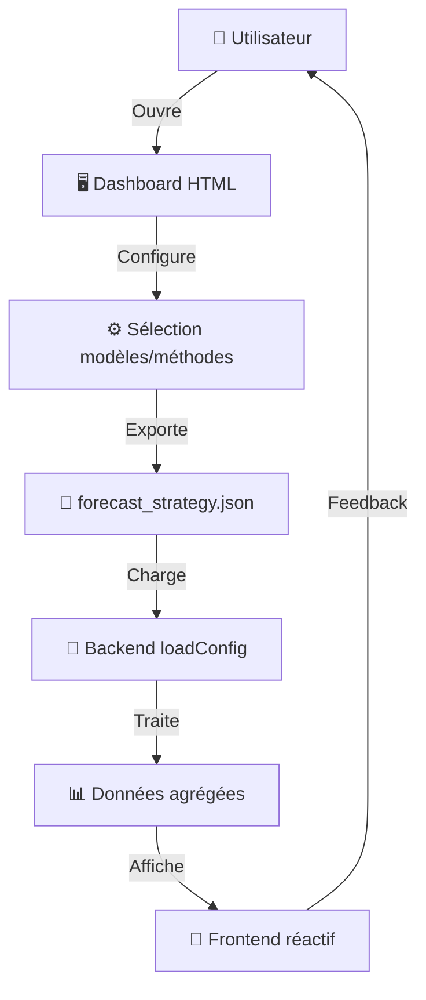

# Weather Surf App 🌊⛈️

Web-app météo et surf pour la Bretagne, intégrant prévisions issues de 11 modèles météo et traitement personnalisable via dashboard.


## 🎯 Fonctionnalités

### Météo Classique

- **Prévision actuelle** : Température, humidité, vent, pression en temps réel
- **Prévisions horaires** : 24h de prévisions détaillées avec graphiques
- **Prévisions hebdomadaires** : 7 jours avec températures min/max et tendances

### Mode Surf Spécialisé

- **Carte des spots** : 8 spots de surf emblématiques de Bretagne
- **Conditions de surf** : Hauteur de houle, vent, marée, score de surf
- **Rose des vents** : Visualisation interactive des directions de vent
- **Recommandations** : Créneaux optimaux par niveau de pratique

### Innovation Technologique

- **11 modèles météo** : AROME, ECMWF, GFS, GraphCast, UKMO, etc.
- **Algorithmes configurables** : Moyenne, médiane, moyenne tronquée, pondération gaussienne
- **Dashboard de configuration** : Interface intuitive pour personnaliser les stratégies
- **Traitement intelligent** : Combinaison optimale des modèles selon l'échéance

## 🛠️ Stack Technique

### Frontend

- **Next.js** : 14.0.x
- **React** : 18.0.x
- **Zustand** : 4.4.x
- **TailwindCSS** : 3.4.17
- **TypeScript** : 5.0.x
- **ESLint** : 8.57.x
- **Testing Library** : 14.3.x / Jest DOM 6.6.x
- **Chart.js** : 4.4.x
- **Recharts** : 2.8.x

### Backend

- **API** : API Routes Next.js (serverless)
- **Services** : Fetch multi-modèles, traitement algorithmique
- **Configuration** : Fichier JSON dynamique avec validation

### Algorithmes Partagés

- **Médiane** : Résistant aux valeurs aberrantes
- **Moyenne tronquée** : Supprime les extrêmes (20% par défaut)
- **Moyenne pondérée** : Privilégie les modèles fiables
- **Gaussienne pondérée** : Poids selon distribution gaussienne

## 📁 Architecture Projet

```
weather-surf-app/
├── 📁 components/          # Composants UI réutilisables
│   ├── NowForecast.tsx     # Prévision actuelle
│   ├── HourlyForecast.tsx  # Prévisions horaires
│   ├── WeeklyForecast.tsx  # Prévisions hebdomadaires
│   └── SurfSpotMap.tsx     # Carte des spots de surf
├── 📁 pages/               # Routes Next.js
│   ├── index.tsx           # Page d'accueil
│   └── api/                # API Routes
│       ├── forecast/       # Endpoints météo
│       └── surf/           # Endpoints surf
├── 📁 backend/             # Services backend
│   ├── services/           # Logique métier
│   └── utils/              # Utilitaires
├── 📁 shared/              # Algorithmes partagés
│   ├── median.js           # Calcul de médiane
│   ├── mean_trimmed.js     # Moyenne tronquée
│   ├── weighted_average.js # Moyenne pondérée
│   └── gaussian_weighted.js# Gaussienne pondérée
├── 📁 store/               # État global Zustand
├── 📁 config/              # Configuration JSON
└── 📁 public/              # Assets statiques + Dashboard
    └── dashboard-configurator/ # Dashboard autonome
```

## 🚀 Installation et Lancement

### Prérequis

- Node.js 18+
- npm ou yarn

### Installation

```bash
# Cloner le repository
git clone https://github.com/votre-username/weather-surf-app.git
cd weather-surf-app

# Installer les dépendances
npm install

# Lancer en développement
npm run dev
```

### Variables d'environnement

Créer un fichier `.env.local` :

```env
# APIs Météo (optionnel pour la demo)
METEO_FRANCE_API_KEY=your_key_here
ECMWF_API_KEY=your_key_here
DEEPMIND_API_KEY=your_key_here
DWD_API_KEY=your_key_here
UKMO_API_KEY=your_key_here
KNMI_API_KEY=your_key_here

# Base URLs
WEATHER_API_BASE_URL=https://api.weather.example.com
SURF_API_BASE_URL=https://api.surf.example.com
```

### Commandes disponibles

```bash
npm run dev      # Développement (port 3000)
npm run build    # Build production
npm run start    # Lancer en production
npm run lint     # Linter ESLint
npm test         # Tests unitaires
```

## ⚙️ Configuration des Stratégies

### Dashboard Interactif

Accédez au dashboard : `http://localhost:3000/dashboard`

Le dashboard permet de :

- ✅ Sélectionner les modèles météo par paramètre et échéance
- ✅ Choisir la méthode de traitement (moyenne, médiane, etc.)
- ✅ Configurer les paramètres spécifiques (poids, sigma, trim%)
- ✅ Prévisualiser la configuration JSON
- ✅ Exporter le fichier de stratégie

### Exemple de Configuration JSON

```json
{
  "temperature": {
    "0-48h": {
      "models": ["arome", "graphcast", "icon_eu"],
      "method": "mean_trimmed",
      "trim_percent": 0.2
    },
    "48-120h": {
      "models": ["ecmwf", "ukmo", "gfs"],
      "method": "median"
    }
  },
  "precipitation": {
    "0-24h": {
      "models": ["arome_hd", "knmi", "arp"],
      "method": "weighted_average",
      "weights": {
        "arome_hd": 0.5,
        "knmi": 0.3,
        "arp": 0.2
      }
    }
  }
}
```

## 🌊 Spots de Surf Inclus

| Spot          | Niveau        | Types de vagues            | Particularités                 |
| ------------- | ------------- | -------------------------- | ------------------------------ |
| **La Torche** | Intermédiaire | Beach break, Gauche/Droite | Spot emblématique du Finistère |
| **La Palue**  | Avancé        | Beach/Reef break           | Conditions puissantes          |
| **Guidel**    | Débutant      | Beach break                | Idéal apprentissage            |
| **Quiberon**  | Intermédiaire | Point break                | Vagues longues                 |
| **Penhors**   | Débutant      | Beach break                | Protégé, familial              |
| **Crozon**    | Intermédiaire | Beach break                | Presqu'île sauvage             |
| **Lannion**   | Débutant      | Beach break                | Côtes d'Armor                  |
| **Erquy**     | Débutant      | Beach break                | Côte d'Émeraude                |

## 🧬 Cycle de Configuration



## 🔧 Développement

### Ajouter un Nouvel Algorithme

1. **Créer la fonction** dans `/shared/` :

```javascript
// shared/my_algorithm.js
export function myAlgorithm(values, params) {
  // Votre logique ici
  return processedValue;
}
```

2. **Importer** dans `applyStrategy.js` :

```javascript
import { myAlgorithm } from "../../shared/my_algorithm.js";
```

3. **Ajouter** au switch dans `applyProcessingMethod()` :

```javascript
case 'my_algorithm':
  return myAlgorithm(values, config.params)
```

### Ajouter un Modèle Météo

1. **Configurer** dans `fetchRawData.js` :

```javascript
const WEATHER_MODELS = {
  // ... modèles existants
  my_model: {
    endpoint: "https://api.mymodel.com",
    headers: { "API-Key": process.env.MY_MODEL_API_KEY },
    resolution: "high",
    coverage: "120h",
  },
};
```

2. **Implémenter** la normalisation :

```javascript
function normalizeMyModelData(data, type) {
  // Convertir au format standard
  return normalizedData;
}
```

## 📊 Algorithmes Détaillés

### Moyenne Tronquée

- **Principe** : Supprime X% des valeurs extrêmes
- **Usage** : Éliminer les outliers tout en gardant la robustesse
- **Paramètres** : `trim_percent` (0.1 à 0.4)

### Moyenne Pondérée

- **Principe** : Poids différents selon la fiabilité des modèles
- **Usage** : Privilégier les modèles performants
- **Paramètres** : `weights` object par modèle

### Gaussienne Pondérée

- **Principe** : Poids selon distance à la médiane (distribution normale)
- **Usage** : Donner plus d'importance aux valeurs centrales
- **Paramètres** : `sigma` (écart-type, 0.5 à 3.0)

## 📈 Performances et Optimisations

### Cache et Performance

- ✅ Cache de configuration (5 min)
- ✅ Validation des données en amont
- ✅ Appels API en parallèle
- ✅ Fallback gracieux si modèles indisponibles

### Monitoring

- ✅ Logs détaillés des appels API
- ✅ Métriques de performance par modèle
- ✅ Alertes en cas d'échec de modèles critiques

## 🚀 Déploiement

### Vercel (Recommandé)

```bash
# Installer Vercel CLI
npm i -g vercel

# Déployer
vercel --prod
```

### Docker

```dockerfile
FROM node:18-alpine
WORKDIR /app
COPY package*.json ./
RUN npm ci --only=production
COPY . .
RUN npm run build
EXPOSE 3000
CMD ["npm", "start"]
```

## 🧪 Tests

### Lancer les tests

```bash
# Tests unitaires
npm test

# Tests des algorithmes
npm run test:algorithms

# Tests d'intégration API
npm run test:api
```

### Coverage

```bash
npm run test:coverage
```

## 🤝 Contribution

1. **Fork** le repository
2. **Créer** une branche feature (`git checkout -b feature/amazing-feature`)
3. **Commit** vos changements (`git commit -m 'Add amazing feature'`)
4. **Push** vers la branche (`git push origin feature/amazing-feature`)
5. **Ouvrir** une Pull Request

### Standards de Code

- ✅ ESLint + Prettier configurés
- ✅ TypeScript strict mode
- ✅ Tests unitaires obligatoires pour les algorithmes
- ✅ Documentation JSDoc pour les fonctions publiques

## 📚 Ressources

### APIs Météo Intégrées

- [Météo France (AROME)](https://meteofrance.com/api)
- [ECMWF](https://www.ecmwf.int/en/forecasts/accessing-forecasts)
- [NOAA GFS](https://www.weather.gov/documentation/services-web-api)
- [DWD (ICON)](https://www.dwd.de/EN/ourservices/opendata/opendata.html)
- [UK Met Office](https://www.metoffice.gov.uk/services/data/datapoint)

### Documentation Technique

- [Next.js Documentation](https://nextjs.org/docs)
- [Recharts Guide](https://recharts.org/en-US/)
- [Zustand Documentation](https://docs.pmnd.rs/zustand/getting-started/introduction)
- [Tailwind CSS](https://tailwindcss.com/docs)

## 📄 Licence

MIT License - voir le fichier [LICENSE](LICENSE) pour plus de détails.

## 👥 Équipe

- **Weather Surf Team** - Développement initial
- **Contributeurs** - Voir [CONTRIBUTORS.md](CONTRIBUTORS.md)

## 🆘 Support

- 📧 Email : support@weather-surf-app.com
- 🐛 Issues : [GitHub Issues](https://github.com/votre-username/weather-surf-app/issues)
- 💬 Discussions : [GitHub Discussions](https://github.com/votre-username/weather-surf-app/discussions)

---

**Fait avec ❤️ pour les surfeurs et passionnés de météo en Bretagne** 🏄‍♂️🌊
# purple-haze
