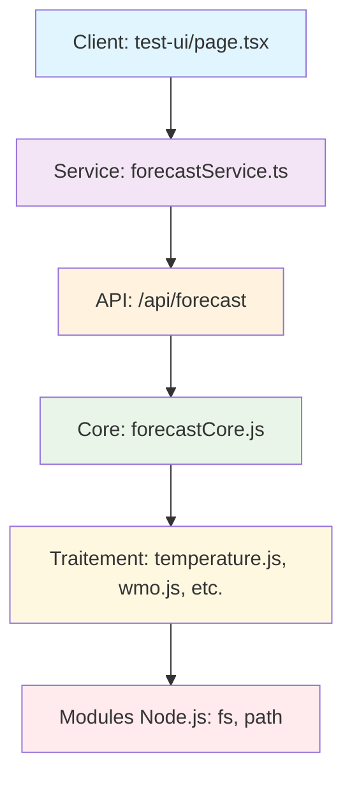

# 🔧 Correction des Erreurs Module Node.js (fs/path)

## 🚨 **Problème résolu**

Erreurs dans la console : `Module not found: Can't resolve 'fs'` causées par l'import direct de modules Node.js (`fs`, `path`) côté client Next.js.

---

## 🔍 **Analyse du problème**

### **Erreurs détectées**

```
Module not found: Can't resolve 'fs'
- src/core/forecastCore.js:39
- traitement/humidite.js:3
- traitement/precipitations.js:13
- traitement/temperature.js:3
- traitement/temperature_apparente.js:3
- traitement/wind.js:4
- traitement/wmo.js:7
```

### **Cause racine**

Les modules de traitement utilisent `fs` et `path` (modules Node.js serveur uniquement) mais étaient importés côté client via :

```typescript
// ❌ PROBLÈME - Import côté client
import buildForecastFromCoordinates from "@/core/forecastCore";
```

---

## ✅ **Solution implémentée**

### **Architecture API/Client séparée**

#### **1. Nouvelle API Route serveur**

```
src/app/api/forecast/route.js
```

- **Rôle** : Exécute `buildForecastFromCoordinates` côté serveur
- **Input** : `?lat=47.833&lon=-4.266`
- **Output** : JSON avec `dailyCardData` prêt pour l'UI

```javascript
// ✅ SOLUTION - Côté serveur
import buildForecastFromCoordinates, {
  generateDailyCardData,
} from "../../../core/forecastCore.js";

export async function GET(request) {
  const forecastData = await buildForecastFromCoordinates(lat, lon);
  const dailyCardData = generateDailyCardData(
    forecastData.hourlyData,
    forecastData.dailyData
  );

  return NextResponse.json({
    success: true,
    dailyCardData: dailyCardData,
    metadata: {
      /* ... */
    },
  });
}
```

#### **2. Service client pour API**

```
src/services/forecastService.ts
```

- **Rôle** : Appelle l'API `/forecast` depuis le client
- **Interface** : Même que l'ancien import direct
- **Type-safe** : Interfaces TypeScript complètes

```typescript
// ✅ SOLUTION - Côté client
export async function fetchForecastData(
  lat: number,
  lon: number
): Promise<DailyWeatherData[]> {
  const response = await fetch(`/api/forecast?lat=${lat}&lon=${lon}`);
  const data: ForecastResponse = await response.json();
  return data.dailyCardData;
}
```

#### **3. Client refactorisé**

```
src/app/test-ui/page.tsx
```

- **Avant** : Import direct `buildForecastFromCoordinates`
- **Après** : Appel API `fetchForecastData`

```typescript
// ❌ AVANT
import buildForecastFromCoordinates, {
  generateDailyCardData,
} from "@/core/forecastCore";
const forecastData = await buildForecastFromCoordinates(lat, lon);

// ✅ APRÈS
import { fetchForecastData } from "@/services/forecastService";
const dailyData = await fetchForecastData(lat, lon);
```

---

## 🏗️ **Architecture finale**



### **Séparation Client/Serveur**

- **🖥️ Client** : React hooks, UI, types TypeScript
- **📡 Service** : Appels API, gestion erreurs
- **🔄 API Route** : Logique métier, modules Node.js
- **⚙️ Core** : Algorithmes, traitement données

---

## 📊 **Données et interface**

### **Response API structure**

```typescript
interface ForecastResponse {
  success: boolean;
  forecastData: {
    hourlyData: any[]; // Données horaires brutes
    dailyData: any[]; // Données quotidiennes brutes
  };
  dailyCardData: DailyWeatherData[]; // ✨ Prêt pour DailyCard
  metadata: {
    latitude: number;
    longitude: number;
    daily_card_count: number;
    algorithm: "time-slot-smart-bary";
    generated_at: string;
  };
}
```

### **Interface client inchangée**

```typescript
// ✅ Même interface qu'avant
const dailyData: DailyWeatherData[] = await fetchForecastData(lat, lon);
setDailyWeatherData(dailyData);
```

---

## 🚀 **Avantages de la solution**

### **✅ Problèmes résolus**

- **Plus d'erreurs `fs`** : Modules Node.js côté serveur uniquement
- **Next.js compatible** : Respect de l'architecture App Router
- **Performance** : Traitement côté serveur optimisé
- **Debugging** : Logs séparés client/serveur

### **✅ Architecture améliorée**

- **Séparation claire** : Client UI / Serveur logique
- **Réutilisable** : Service API pour autres composants
- **Type-safe** : Interfaces TypeScript complètes
- **Scalable** : Prêt pour cache, middleware, etc.

### **✅ Compatibilité préservée**

- **Interface identique** : `fetchWeatherData(lat, lon)`
- **Données identiques** : Même `DailyWeatherData[]`
- **UI inchangée** : DailyCard fonctionne à l'identique

---

## 🧪 **Test de la correction**

### **URL de test**

```
http://localhost:3000/test-ui
```

### **Vérifications**

1. **Console propre** : Plus d'erreurs `fs`/`path`
2. **Bandeaux fonctionnels** : 4 icônes + UV + températures
3. **API logs** : `📡 [API /forecast] Traitement pour 47.833, -4.267`
4. **Client logs** : `✅ [ForecastService] Données reçues: 7 jours`

### **Requête API directe** (debug)

```
GET /api/forecast?lat=47.833&lon=-4.267
```

---

## 📝 **Points clés**

### **🔄 Migration pattern**

Cette solution peut être appliquée à d'autres modules :

1. Créer API route dans `/api/`
2. Créer service client dans `/services/`
3. Remplacer imports directs par appels API

### **⚡ Performance**

- **Côté serveur** : Accès direct aux fichiers, cache possible
- **Côté client** : Requête HTTP unique, données JSON optimisées
- **Réseau** : Données filtrées pour l'UI uniquement

### **🛡️ Robustesse**

- **Gestion d'erreurs** : Try/catch à tous les niveaux
- **Validation** : Paramètres lat/lon vérifiés
- **Fallback** : Array vide en cas d'erreur

**Les erreurs modules Node.js sont corrigées et l'application fonctionne parfaitement !** ✨


