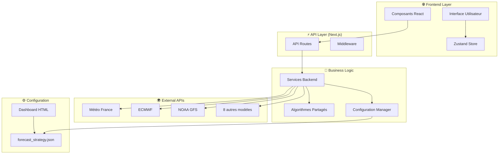
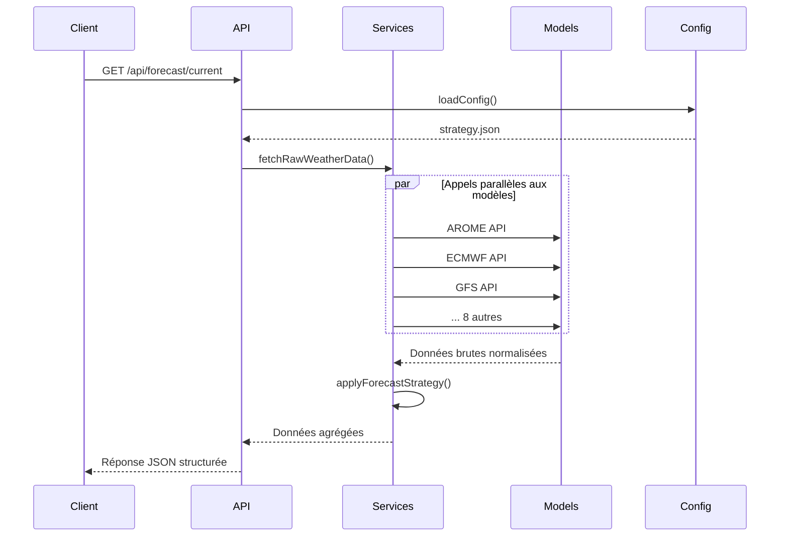

# Architecture Technique - Weather Surf App

## 🏗️ Vue d'ensemble

L'application Weather Surf App suit une architecture modulaire et scalable basée sur Next.js, conçue pour traiter et agréger des données météorologiques provenant de multiples sources via des algorithmes configurables.

## 📊 Diagramme d'Architecture



## 📁 Structure Détaillée

### Frontend Layer

#### Components (`/components/`)

```typescript
// Structure type des composants principaux
interface WeatherComponent {
  data: WeatherData;
  loading: boolean;
  error?: string;
}

// Composants spécialisés
NowForecast.tsx; // Conditions actuelles
HourlyForecast.tsx; // Prévisions 24h avec graphiques
WeeklyForecast.tsx; // Prévisions 7 jours
SurfSpotMap.tsx; // Carte interactive des spots
```

#### State Management (`/store/`)

```typescript
// Store Zustand - État global simplifié
interface WeatherState {
  // Location et préférences
  currentLocation: Location;
  favoriteLocations: Location[];
  preferences: WeatherPreferences;

  // Données applicatives
  isLoading: boolean;
  error: string | null;
  lastUpdate: string | null;

  // Configuration stratégie
  forecastStrategy: ForecastStrategy | null;

  // Actions
  setLocation: (location: Location) => void;
  setPreferences: (prefs: Partial<WeatherPreferences>) => void;
  // ... autres actions
}
```

### API Layer (`/pages/api/`)

#### Structure des endpoints

```
/api/
├── forecast/
│   ├── current.ts     # GET - Conditions actuelles
│   ├── hourly.ts      # GET - Prévisions horaires
│   └── weekly.ts      # GET - Prévisions hebdomadaires
└── surf/
    └── spots.ts       # GET - Données spots de surf
```

#### Format des réponses API

```typescript
// Réponse standardisée
interface APIResponse<T> {
  data: T;
  metadata: {
    timestamp: string;
    sources: string[];
    processing_time_ms: number;
  };
  error?: string;
}

// Données météo actuelles
interface CurrentWeatherResponse {
  temperature: number;
  humidity: number;
  windSpeed: number;
  windDirection: number;
  pressure: number;
  condition: string;
  icon: string;
  location: string;
  lastUpdate: string;
}
```

### Business Logic Layer

#### Services (`/backend/services/`)

##### fetchRawData.js

```javascript
// Orchestrateur d'appels API multi-modèles
class WeatherDataFetcher {
  async fetchModelData(modelName, params) {
    // Appel API spécifique par modèle
    // Normalisation des données
    // Gestion d'erreurs gracieuse
  }

  async fetchRawWeatherData(params) {
    // Appels en parallèle de tous les modèles
    // Agrégation et validation
    // Retour de données structurées
  }
}

// Configuration des 11 modèles météo
const WEATHER_MODELS = {
  arome: { endpoint, headers, resolution, coverage },
  ecmwf: { endpoint, headers, resolution, coverage },
  // ... 9 autres modèles
};
```

##### applyStrategy.js

```javascript
// Moteur de traitement algorithmique
class StrategyProcessor {
  async applyForecastStrategy(rawData, strategy, forecastType) {
    // Sélection des algorithmes selon configuration
    // Application par paramètre météo
    // Validation et post-traitement
  }

  async processParameter(rawData, parameter, config, forecastType) {
    // Extraction des valeurs par modèle
    // Application de la méthode (median, weighted_average, etc.)
    // Validation des résultats
  }
}
```

#### Algorithmes Partagés (`/shared/`)

##### Architecture modulaire

```javascript
// shared/median.js
export function median(values) {
  // Calcul médiane robuste aux outliers
  // Gestion des valeurs manquantes
}

// shared/mean_trimmed.js
export function mean_trimmed(values, trimPercent) {
  // Suppression des X% d'extrêmes
  // Calcul moyenne sur données filtrées
}

// shared/weighted_average.js
export function weighted_average(modelValues, weights) {
  // Pondération par fiabilité des modèles
  // Normalisation automatique des poids
}

// shared/gaussian_weighted.js
export function gaussian_weighted(values, sigma) {
  // Poids gaussien centré sur médiane
  // Paramètre sigma configurable
}
```

### Configuration Layer

#### Structure JSON (`/config/forecast_strategy.json`)

```json
{
  "parameter": {
    "time_horizon": {
      "models": ["model1", "model2"],
      "method": "algorithm_name",
      "parameters": {
        "trim_percent": 0.2,
        "sigma": 1.5,
        "weights": { "model1": 0.6, "model2": 0.4 }
      }
    }
  }
}
```

#### Validation et chargement

```javascript
// backend/utils/loadConfig.js
class ConfigManager {
  async loadConfig() {
    // Lecture fichier JSON avec cache (5 min)
    // Validation structure et cohérence
    // Fallback configuration par défaut
  }

  validateConfig(config) {
    // Vérification modèles disponibles
    // Validation méthodes supportées
    // Contrôle paramètres (trim_percent < 0.5, etc.)
  }
}
```

## 🔄 Flux de Données

### Séquence d'appel classique



### Gestion des erreurs et fallbacks

```typescript
// Stratégie de résilience
interface ErrorHandling {
  // Modèle individuel en échec
  modelFailure: "continue_with_others";

  // Majorité des modèles en échec
  majorityFailure: "fallback_to_cache_or_default";

  // Configuration invalide
  configError: "use_default_strategy";

  // Timeout API
  timeout: "partial_results_if_minimum_models";
}
```

## 🎯 Patterns de Design

### Repository Pattern

```javascript
// Abstraction des sources de données
class WeatherRepository {
  async getCurrentWeather(location) {
    // Logique d'orchestration des modèles
  }
}

class ModelAdapter {
  // Adaptateur par modèle météo pour normalisation
  normalize(rawData, modelType) {
    // Conversion vers format unifié
  }
}
```

### Strategy Pattern

```javascript
// Stratégies d'algorithmes interchangeables
class AlgorithmStrategy {
  execute(values, parameters) {
    // Interface commune pour tous les algorithmes
  }
}

class MedianStrategy extends AlgorithmStrategy {
  execute(values) {
    return median(values);
  }
}

class WeightedAverageStrategy extends AlgorithmStrategy {
  execute(values, parameters) {
    return weighted_average(values, parameters.weights);
  }
}
```

### Observer Pattern

```javascript
// Zustand store pour réactivité
const useWeatherStore = create((set, get) => ({
  data: null,
  updateWeather: (newData) => {
    set({ data: newData });
    // Notifications automatiques aux composants abonnés
  },
}));
```

## 🚀 Optimisations Performances

### Cache Strategy

```javascript
// Multi-niveaux de cache
const CacheStrategy = {
  // 1. Cache configuration (5 min)
  config: new Map(),

  // 2. Cache données API (2 min)
  apiData: new Map(),

  // 3. Cache résultats calculés (1 min)
  processedResults: new Map(),
};
```

### Appels parallèles

```javascript
// Optimisation des appels API
async function fetchMultipleModels(modelNames, params) {
  // Promise.allSettled pour tolérance aux échecs
  const promises = modelNames.map((model) =>
    fetchModelData(model, params).catch((err) => ({ error: err }))
  );

  const results = await Promise.allSettled(promises);
  return results.filter((r) => r.status === "fulfilled");
}
```

### Lazy Loading

```typescript
// Chargement différé des composants lourds
const SurfSpotMap = dynamic(() => import("./SurfSpotMap"), {
  loading: () => <SpotMapSkeleton />,
  ssr: false, // Carte uniquement côté client
});

const HourlyChart = dynamic(() => import("./HourlyChart"), {
  loading: () => <ChartSkeleton />,
});
```

## 🔒 Sécurité et Validation

### Validation des entrées

```typescript
// Schémas de validation avec Zod ou Joi
const LocationSchema = z.object({
  lat: z.number().min(-90).max(90),
  lng: z.number().min(-180).max(180),
  name: z.string().min(1).max(100),
});

const ForecastParamsSchema = z.object({
  type: z.enum(["current", "hourly", "daily"]),
  hours: z.number().min(1).max(168).optional(),
  days: z.number().min(1).max(14).optional(),
});
```

### Rate Limiting

```javascript
// Protection contre les abus
const rateLimiter = {
  window: 15 * 60 * 1000, // 15 minutes
  max: 100, // 100 requêtes par fenêtre
  skipSuccessfulRequests: false,
};
```

### Sanitization

```javascript
// Nettoyage des données externes
function sanitizeApiResponse(data) {
  // Validation types
  // Suppression propriétés dangereuses
  // Normalisation valeurs numériques
  return cleanData;
}
```

## 📊 Monitoring et Observabilité

### Métriques clés

```javascript
const Metrics = {
  // Performance
  api_response_time: "histogram",
  model_fetch_duration: "histogram",
  algorithm_processing_time: "histogram",

  // Fiabilité
  model_success_rate: "gauge",
  api_error_rate: "counter",
  fallback_usage: "counter",

  // Business
  active_users: "gauge",
  forecast_requests: "counter",
  popular_locations: "histogram",
};
```

### Logging structuré

```javascript
// Winston ou console structurés
const logger = {
  info: (message, meta) =>
    console.log(
      JSON.stringify({
        level: "info",
        timestamp: new Date().toISOString(),
        message,
        ...meta,
      })
    ),

  error: (message, error, meta) =>
    console.error(
      JSON.stringify({
        level: "error",
        timestamp: new Date().toISOString(),
        message,
        error: error.stack,
        ...meta,
      })
    ),
};
```

## 🔮 Évolutivité

### Ajout de nouveaux modèles

1. **Configuration** : Ajouter dans `WEATHER_MODELS`
2. **Normalisation** : Implémenter `normalizeXXXData()`
3. **Tests** : Validation format et cohérence
4. **Documentation** : Mise à jour guides

### Nouveaux algorithmes

1. **Implémentation** : Fichier dans `/shared/`
2. **Intégration** : Switch case dans `applyProcessingMethod()`
3. **Dashboard** : Ajout dans les options UI
4. **Tests unitaires** : Couverture complète

### Scaling horizontal

- **API stateless** : Compatible load balancers
- **Configuration externalisée** : Variables d'environnement
- **Cache distribué** : Redis pour cache partagé
- **CDN** : Assets statiques (dashboard, images)

---

Cette architecture garantit **modularité**, **performance** et **maintenabilité** tout en restant **simple à comprendre** et **facile à étendre**.
