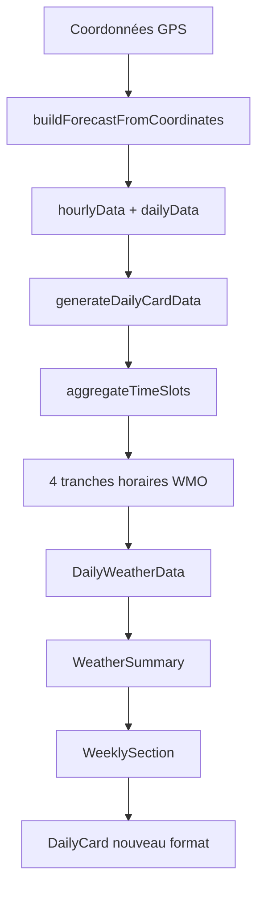

# 📅 Implémentation des Bandeaux Quotidiens avec Tranches Horaires

## 🎯 **Objectif réalisé**

Transformation complète du composant `DailyCard.tsx` pour afficher les informations quotidiennes avec les **4 tranches horaires** issues de l'algorithme `time-slot-smart-bary.js`, tout en conservant la taille et le style actuel des bandeaux.

---

## 🔧 **Modifications principales**

### **1. ✅ Nouveau format d'affichage DailyCard**

#### **En-tête : Initiales des jours**

```typescript
// Utilitaire: src/utils/dayUtils.ts
const DAY_INITIALS: Record<string, string> = {
  "Aujourd'hui": "Auj.",
  Demain: "Dem.",
  Lundi: "L.",
  Mardi: "M.",
  // ... etc
};
```

#### **4 icônes des tranches horaires**

- **00-06h** : Nuit
- **06-12h** : Matin
- **12-18h** : Après-midi
- **18-00h** : Soirée

Icônes générées par `time-slot-smart-bary.js` + mapping WMO → emoji.

#### **Températures min/max arrondies**

- **Max** : Blanc, gras, `Math.round()`
- **Min** : Bleu (`#64b5f6`), `Math.round()`

#### **Indice UV avec pastille colorée**

```typescript
// Échelle UV selon standards OMS
const UV_SCALE: UVScale[] = [
  { min: 1, max: 2, color: "#8BC34A", label: "Low" }, // Vert
  { min: 3, max: 5, color: "#FFC107", label: "Moderate" }, // Jaune
  { min: 6, max: 7, color: "#FF9800", label: "High" }, // Orange
  { min: 8, max: 10, color: "#F44336", label: "Very High" }, // Rouge
  { min: 11, max: 20, color: "#9C27B0", label: "Extreme" }, // Violet
];
```

#### **Cumul précipitations journalières**

Affiché en mm avec couleur bleue, format `0.0mm`.

---

## 🏗️ **Architecture technique**

### **Fichiers créés/modifiés**

#### **📁 Utilitaires créés**

```
src/utils/
├── uvScale.ts      # Échelle UV avec couleurs OMS
├── dayUtils.ts     # Initiales des jours de la semaine
└── wmoIcons.ts     # Mapping WMO → icônes emoji (temporaire)
```

#### **📁 Types ajoutés**

```
src/types/
└── dailyData.ts    # Interface DailyWeatherData avec timeSlots
```

#### **📁 Composants modifiés**

```
src/components/legacy-ui/
├── DailyCard.tsx       # ✅ Support nouveau + legacy format
├── WeeklySection.tsx   # ✅ Détection automatique format données
└── WeatherSummary.tsx  # ✅ Intégration WeeklySection
```

#### **📁 Core amélioré**

```
src/core/
└── forecastCore.js     # ✅ Fonction generateDailyCardData()
```

---

## 🔄 **Interface DailyCard hybride**

### **Rétrocompatibilité totale**

Le composant détecte automatiquement le format des données :

```typescript
const useNewFormat = timeSlots.length > 0;

{
  useNewFormat ? (
    // NOUVEAU FORMAT avec tranches horaires
    <>{/* 4 icônes + UV pastille + initiales */}</>
  ) : (
    // FORMAT LEGACY inchangé
    <>{/* Emoji + description + extras */}</>
  );
}
```

### **Props supportées**

```typescript
interface DailyCardProps {
  // Nouvelles props
  timeSlots?: TimeSlotData[]; // Tranches horaires
  precipitation_total?: number; // Cumul précipitations

  // Props legacy (rétrocompatibilité)
  emoji?: string;
  description?: string;
  precipitation?: number;
  windSpeed?: number;
}
```

---

## 🌡️ **Intégration avec time-slot-smart-bary**

### **Flux de données complet**



### **Données des tranches**

```typescript
interface TimeSlotData {
  tranche: string; // "00-06", "06-12", etc.
  code_wmo_final: number | null; // Code WMO agrégé
  risques: Array<{
    tranche: string;
    type: string; // "Orage", "Pluie", etc.
    qty: number;
  }>;
  precipitation_total: number; // mm dans la tranche
}
```

---

## 🎨 **Design et responsive**

### **Structure visuelle**

```
┌─────┬─────────────────────┬──────┬─────┬──────┐
│ L.  │ 🌤️ ⛅ 🌧️ ☁️      │ 17°  │ UV5 │ 2.3mm│
│     │                     │  8°  │     │      │
└─────┴─────────────────────┴──────┴─────┴──────┘
```

### **Proportions flex**

- **Initiale** : `flex: 0.8`
- **4 icônes** : `flex: 2`
- **Températures** : `flex: 1`
- **UV** : `flex: 0.8`
- **Précipitations** : `flex: 1`

### **Responsive mobile**

```css
@media (max-width: 768px) {
  .time-slots {
    gap: 4px !important;
  }
  .slot-icon {
    font-size: 1em !important;
  }
  .uv-index div {
    width: 28px !important;
    height: 28px !important;
  }
}
```

---

## 📊 **Test et validation**

### **Page test-ui intégrée**

- **URL** : `http://localhost:3000/test-ui`
- **Coordonnées GPS réelles** : Utilise `buildForecastFromCoordinates(lat, lon)`
- **Données live** : API météo + algorithme smart_bary
- **Debug** : Affichage nombre de jours, statut chargement

### **Format de données test**

```typescript
const dailyData: DailyWeatherData[] = [
  {
    dayName: "Aujourd'hui",
    date: "15 Nov",
    tempMax: 17,
    tempMin: 8,
    uvIndex: 5,
    precipitation_total: 2.3,
    timeSlots: [
      { tranche: "00-06", code_wmo_final: 3 /* ... */ },
      { tranche: "06-12", code_wmo_final: 1 /* ... */ },
      { tranche: "12-18", code_wmo_final: 61 /* ... */ },
      { tranche: "18-00", code_wmo_final: 2 /* ... */ },
    ],
    isToday: true,
  },
  // ... 6 autres jours
];
```

---

## 🔗 **Points clés**

### **✅ Spécifications respectées**

1. **Initiales jours** : L. M. Me. J. V. S. D.
2. **4 icônes tranches** : Issues de `time-slot-smart-bary.js`
3. **Températures arrondies** : `Math.round()`, min en bleu, max en blanc gras
4. **UV pastille colorée** : Selon échelle OMS, "N/A" si indisponible
5. **Précipitations cumul** : Format "X.Xmm"
6. **Pas de hardcoding** : Données via forecastCore + coordonnées GPS
7. **Taille/style conservés** : Bandeaux identiques, contenu modifié

### **✅ Architecture modulaire**

- **Composants réutilisables** : Utilitaires dans `/utils`
- **Types stricts** : Interfaces TypeScript
- **Rétrocompatibilité** : Format legacy préservé
- **Prêt migration** : Structure pour HomePage

### **✅ Intégration temps réel**

- **API météo live** : Via coordonnées GPS
- **Algorithme production** : `time-slot-smart-bary.js`
- **Cache localStorage** : Localisation persistante
- **Debug complet** : Statuts visibles en temps réel

---

## 🚀 **Prochaines étapes**

1. **Validation utilisateur** sur `/test-ui`
2. **Mapping WMO robuste** (remplacer temporaire)
3. **Migration HomePage** quand validé
4. **Tests unitaires** composants
5. **Optimisation performances** (memoization)

**Les bandeaux quotidiens sont opérationnels avec données réelles et tranches horaires !** ✨


